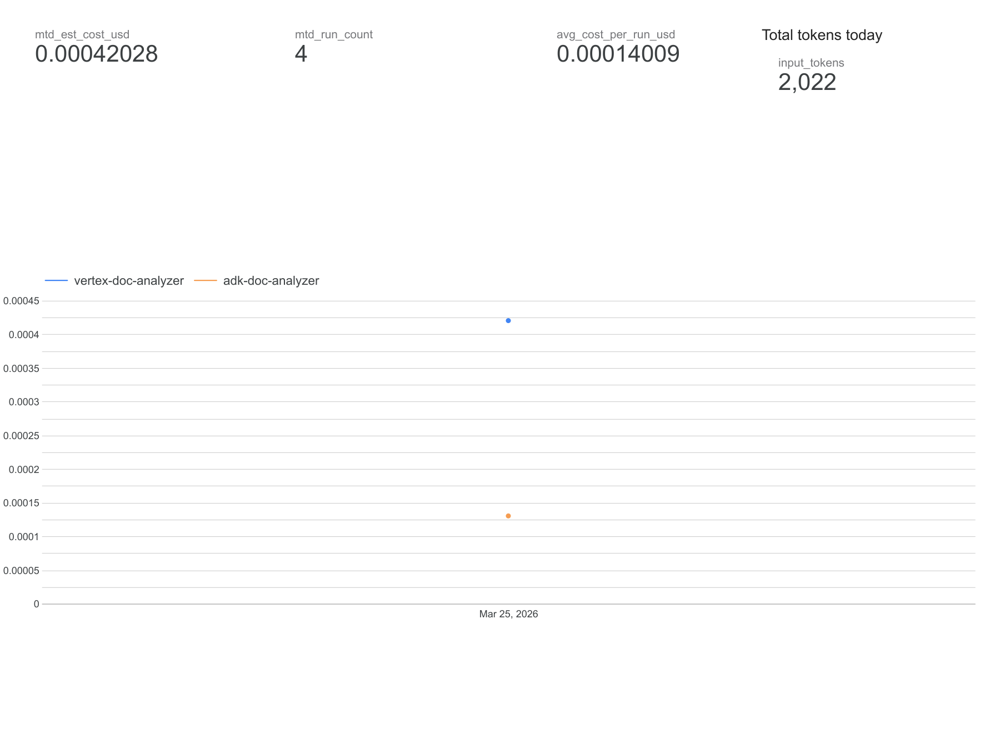
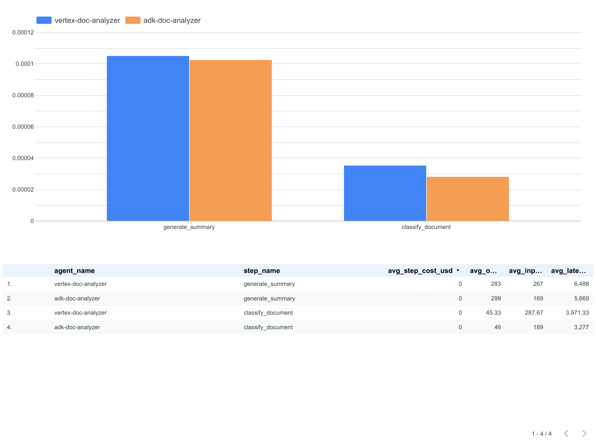
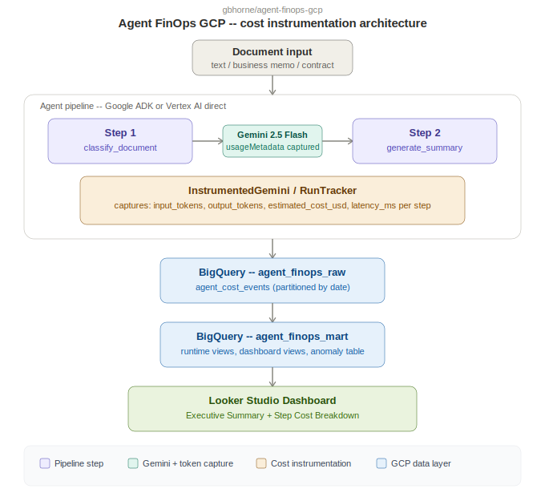

# Agent FinOps: GCP

A full end-to-end FinOps build for agentic AI on Google Cloud. Two live agents (Google ADK and Vertex AI) process real documents using Gemini 2.5 Flash, capturing actual token costs from the Vertex AI API response and writing structured cost events to BigQuery. A Looker Studio dashboard visualizes real per-run costs, step-level token breakdown, and framework cost comparison.

**This is not a simulation.** Every cost figure in this repo came from real Gemini API calls against a live GCP project.

---

## Disclaimer

This project uses synthetic document inputs generated for demonstration purposes. No real customer data, proprietary information, or personally identifiable information is used at any stage. All cost figures reflect actual Vertex AI API usage on the finops-gcp-agent GCP project.

---

## Live Dashboard

### Executive Summary—MTD cost, run count, token totals, daily spend trend



### Step Cost Breakdown—cost per pipeline step by framework



---

## What This Builds

Two document analysis agents—identical pipeline logic, different frameworks—both writing real cost data to the same BigQuery table:

| Agent | Framework | BigQuery tag |
|-------|-----------|-------------|
| ADK Document Analyzer | Google ADK + Gemini 2.5 Flash | adk-doc-analyzer |
| Vertex Document Analyzer | Vertex AI direct + Gemini 2.5 Flash | vertex-doc-analyzer |

Each agent runs a two-step pipeline:
1. Classify—document type, priority, topic (one Gemini call)
2. Summarize—structured executive summary with key points and action items (one Gemini call)

Every Gemini call captures actual token counts from usageMetadata.prompt_token_count and usageMetadata.candidates_token_count—the same data Vertex AI uses for billing—and calculates per-step cost at runtime pricing.

---

## Key Findings From Live Data

| Metric | vertex-doc-analyzer | adk-doc-analyzer |
|--------|--------------------|--------------------|
| Avg input tokens (classify) | 288 | 189 |
| Avg input tokens (summarize) | 267 | 169 |
| Avg latency (classify) | 3,971ms | 3,277ms |
| Avg cost per run | ~$0.00016 | ~$0.00013 |

The ADK framework adds less prompt overhead than the direct Vertex AI implementation—observable in real token count data from live API calls.

---

## Architecture



---

## Repository Structure

```
agent-finops-gcp/
agents/
  cost_tracker.py         Core instrumentation: token capture and BigQuery writer
  adk_agent.py            Google ADK document analysis agent
  vertex_agent.py         Vertex AI document analysis agent and test runner
  agent.py                ADK entry point
sql/
  01_create_runtime_tables.sql  BigQuery datasets and tables
  02_billing_views.sql          Cloud Billing export views
  03_runtime_views.sql          Runtime cost views
  04_dashboard_views.sql        Looker Studio data source views
  05_anomaly_queries.sql        Anomaly detection and mart rebuild
app/
  token_instrumentation.py  Standalone instrumentation module
  cost_event_writer.py      BigQuery writer
  demo_agent.py             Simulated data loader
docs/
  ARCHITECTURE.md
  dashboard_executive_summary.png
  dashboard_step_breakdown.png
```

---


## GCP Infrastructure

| Service | Role |
|---------|------|
| Vertex AI (Gemini 2.5 Flash) | Document classification and summarization |
| BigQuery (agent_finops_raw) | Raw cost events—one row per step per run |
| BigQuery (agent_finops_mart) | Aggregated views for Looker Studio |
| Looker Studio | Live cost dashboard |
| Google ADK | ADK agent orchestration |

---

*Built by [Gregory Horne](https://github.com/gbhorne)—GCP Agentic Systems and Agent FinOps portfolio.*
