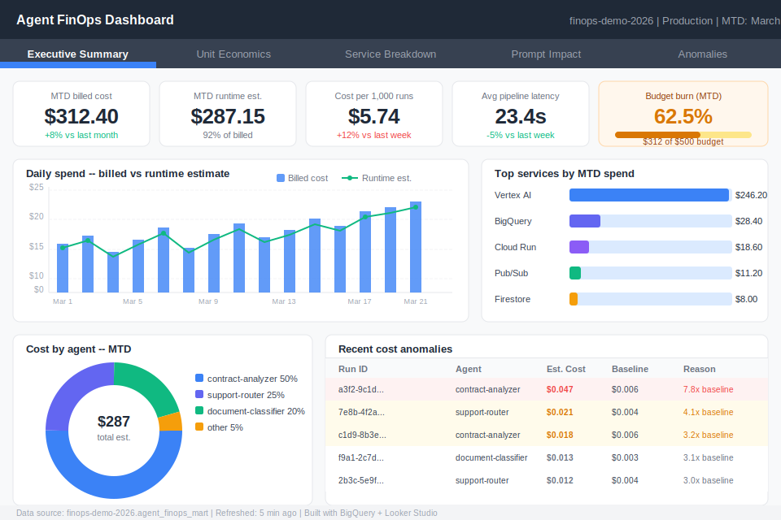

# Agent FinOps -- GCP

FinOps architecture for agentic AI on Google Cloud. Combines Cloud Billing export data with runtime token instrumentation from Vertex AI to show how AI agent costs accumulate across model inference, data services, messaging, and observability. Visualized in a Looker Studio dashboard showing actual cloud spend, estimated per-run unit economics, budget burn, and anomaly detection.

---

## Disclaimer

This project uses simulated pipeline data generated for demonstration purposes. No real patient data, customer data, or proprietary information is used at any stage. All cost figures are estimates based on current public Google Cloud pricing.

---

## Dashboard Preview



---

## Architecture

Two-layer cost observability platform:

**Layer 1 -- Cloud Billing actuals**
Cloud Billing export to BigQuery provides ground-truth billed cost aggregated by service and SKU. Available with 24-48 hour lag.

**Layer 2 -- Pipeline unit economics**
Runtime token instrumentation inside each agent pipeline captures per-step cost at execution time. Available in real time with per-run and per-step granularity.

Both layers land in BigQuery. Scheduled queries build daily mart tables. Views join billing actuals with runtime estimates. Looker Studio connects directly to the views.

See [docs/ARCHITECTURE.md](docs/ARCHITECTURE.md) for the full data flow diagram and design decisions.

---

## Repository Structure

```
agent-finops-gcp/
├── README.md
├── docs/
│   ├── ARCHITECTURE.md
│   └── looker-dashboard-mockup.svg
├── sql/
│   ├── 01_create_runtime_tables.sql    -- BigQuery datasets and tables
│   ├── 02_billing_views.sql            -- Views over Cloud Billing export
│   ├── 03_runtime_views.sql            -- Views over runtime cost events
│   ├── 04_dashboard_views.sql          -- Combined views for Looker Studio
│   └── 05_anomaly_queries.sql          -- Anomaly detection + mart rebuild
├── app/
│   ├── token_instrumentation.py        -- Gemini call wrapper + cost accumulator
│   ├── cost_event_writer.py            -- BigQuery writer for cost events
│   └── demo_agent.py                   -- Simulated agent runs for demo data
```

---

## Setup

### Prerequisites

- GCP project `finops-demo-2026` with billing enabled
- `gcloud` CLI authenticated
- Python 3.11+
- Cloud Billing export enabled (see step 3 below)

### Step 1 -- Enable APIs

```bash
gcloud services enable bigquery.googleapis.com \
  cloudresourcemanager.googleapis.com \
  monitoring.googleapis.com \
  pubsub.googleapis.com \
  billingbudgets.googleapis.com \
  --project=finops-demo-2026
```

### Step 2 -- Create BigQuery datasets and tables

```bash
bq mk --project_id=finops-demo-2026 --dataset agent_finops_raw
bq mk --project_id=finops-demo-2026 --dataset agent_finops_mart
bq mk --project_id=finops-demo-2026 --dataset billing_raw
```

Then run the SQL files in order:

```bash
bq query --project_id=finops-demo-2026 --use_legacy_sql=false < sql/01_create_runtime_tables.sql
bq query --project_id=finops-demo-2026 --use_legacy_sql=false < sql/03_runtime_views.sql
bq query --project_id=finops-demo-2026 --use_legacy_sql=false < sql/04_dashboard_views.sql
bq query --project_id=finops-demo-2026 --use_legacy_sql=false < sql/05_anomaly_queries.sql
```

Run `02_billing_views.sql` only after billing export is configured (step 3).

### Step 3 -- Configure Cloud Billing export

1. Go to GCP Console > Billing > Billing export
2. Enable **Standard usage cost** export
3. Enable **Detailed usage cost** export
4. Set destination dataset to `finops-demo-2026.billing_raw`
5. Allow 24-48 hours for the first export to populate

Once billing export is active:

```bash
bq query --project_id=finops-demo-2026 --use_legacy_sql=false < sql/02_billing_views.sql
```

### Step 4 -- Load demo data

```bash
pip install google-cloud-bigquery vertexai
python -m app.demo_agent --runs 500 --project finops-demo-2026 --days 30
```

This generates 500 simulated pipeline runs across three agent types (document-classifier, contract-analyzer, support-router) with realistic token distributions, urgency levels, and occasional anomalies.

### Step 5 -- Configure BigQuery scheduled queries

**Nightly mart rebuild** (runs at 01:00 UTC daily):

```bash
bq query --project_id=finops-demo-2026 \
  --use_legacy_sql=false \
  --schedule="every 24 hours" \
  --display_name="agent_cost_daily_mart_rebuild" \
  "$(cat sql/05_anomaly_queries.sql | grep -A 30 'Daily mart rebuild')"
```

**Hourly anomaly detection**:

```bash
bq query --project_id=finops-demo-2026 \
  --use_legacy_sql=false \
  --schedule="every 1 hours" \
  --display_name="agent_cost_anomaly_detection" \
  "$(cat sql/05_anomaly_queries.sql | grep -A 40 'Main anomaly detection')"
```

### Step 6 -- Connect Looker Studio

1. Go to [lookerstudio.google.com](https://lookerstudio.google.com)
2. Create a new report
3. Add data source: BigQuery
4. Connect to `finops-demo-2026.agent_finops_mart`
5. Add the following views as data sources:
   - `dashboard_executive_summary` -- Page 1 cards and daily spend chart
   - `dashboard_unit_economics` -- Page 2 agent breakdown
   - `billing_ai_services` -- Page 3 service breakdown
   - `dashboard_prompt_impact` -- Page 4 token trend
   - `dashboard_anomalies` -- Page 5 anomaly table

See [docs/ARCHITECTURE.md](docs/ARCHITECTURE.md) for recommended chart types and layout for each dashboard page.

### Step 7 -- Configure budget alerts

```bash
# Create a $500/month budget with alerts at 50%, 80%, 90%, 100%
gcloud billing budgets create \
  --billing-account=YOUR_BILLING_ACCOUNT_ID \
  --display-name="agent-finops-demo-budget" \
  --budget-amount=500USD \
  --threshold-rule=percent=0.5 \
  --threshold-rule=percent=0.8 \
  --threshold-rule=percent=0.9 \
  --threshold-rule=percent=1.0
```

Replace `YOUR_BILLING_ACCOUNT_ID` with your GCP billing account ID (format: `XXXXXX-XXXXXX-XXXXXX`).

---

## Instrumenting Your Own Agent

Add cost tracking to any Python agent pipeline in three steps.

**Step 1 -- Create a cost accumulator at pipeline start:**

```python
from app.token_instrumentation import RunCostAccumulator, InstrumentedGemini
import uuid

accumulator = RunCostAccumulator(
    run_id=str(uuid.uuid4()),
    agent_name="my-agent",
    workflow_name="my-workflow",
    environment="production",
    project_id="finops-demo-2026",
    region="us-central1",
)
```

**Step 2 -- Wrap each Gemini call:**

```python
gemini = InstrumentedGemini(
    model_name="gemini-2.5-flash",
    accumulator=accumulator,
    project="finops-demo-2026",
)

result = gemini.generate(prompt=my_prompt, step_name="classify_document")
```

**Step 3 -- Write cost events at pipeline end:**

```python
from app.cost_event_writer import CostEventWriter

writer = CostEventWriter(project_id="finops-demo-2026")
writer.write_safe(accumulator)
```

That is the complete instrumentation. Token counts are captured from the Vertex AI `usageMetadata` response -- actual billed usage, not estimates.

---

## Dashboard Pages

| Page | Data source | Key metrics |
|------|-------------|-------------|
| Executive Summary | `dashboard_executive_summary` | MTD cost, cost per 1K runs, budget burn % |
| Unit Economics | `dashboard_unit_economics` | Cost by agent, urgency, workflow |
| Service Breakdown | `billing_ai_services` | Vertex AI vs other services spend |
| Prompt Impact | `dashboard_prompt_impact` | Token trend, cost before/after changes |
| Anomalies | `dashboard_anomalies` | Runs exceeding 3x baseline, root cause |

---

## Key SQL Views

| View | Purpose |
|------|---------|
| `runtime_daily_agent` | Daily cost per agent, run count, token totals |
| `runtime_step_cost` | Cost breakdown by pipeline step |
| `token_trend_daily` | Daily average token counts -- detects prompt inflation |
| `runtime_cost_by_urgency` | Cost segmented by case complexity |
| `budget_burn_rate` | MTD spend vs monthly budget with projected month-end |
| `top_expensive_runs` | Top 100 most expensive runs in last 7 days |
| `run_cost_anomalies` | Runs exceeding 3 standard deviations from baseline |

---

*Built by [Gregory Horne](https://github.com/gbhorne) -- Healthcare AI and GCP agentic systems portfolio.*
